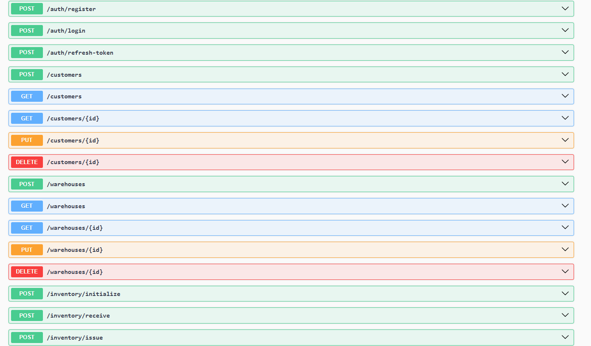

# Mini ERP System

A backend ERP system built with ASP.NET Core Web API using Clean Architecture principles.
frontend Blazor razor

## Overview

MiniERP is an enterprise management system designed to manage products, categories, inventory and business operations.

## Technologies

- ASP.NET Core Web API
- Entity Framework Core
- SQL Server
- Clean Architecture
- Repository Pattern
- Dependency Injection
- JWT Authentication
- Swagger
- FluentValidation
- AutoMapper

## Architecture
## Features
✅ User Authentication  
✅ JWT Authorization  
✅ Product Management  
✅ Category Management  
✅ Inventory Management  
✅ CRUD Operations  
✅ Validation  
✅ Exception Handling  
✅ Swagger Documentation

## API Documentation

Swagger UI:

## Database

SQL Server + Entity Framework Core

Migrations:
The project follows Clean Architecture:
